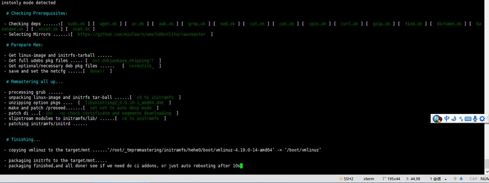
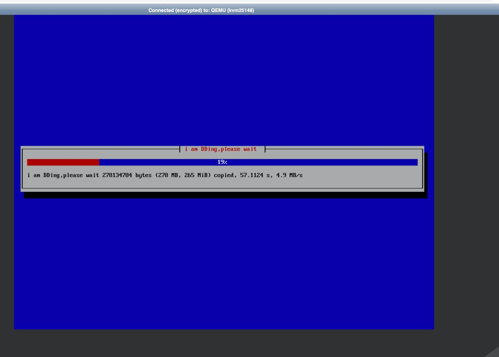

inst.sh manual：
======

由于onekeydevdesk直接托管在gitee.com/minlearn/onekeydevdesk公开仓库下，脚本，debian镜像,系统镜像一体，最方便讲解（这也正是前述inst.sh的优点体现之一which the name "1keydd" implies），onekeydevdesk也是inst.sh默认支持的系统，所以先讲。


稍后讲其它自定义镜像安装，最后讲打包一个镜像集成到仓库的方法


利用inst.sh安装onekeydevdesk
------

首先，系统要求debian<=18.06，不能centos
1，进入这台云主机的vnc，打开命令行，2，或者直接在ssh下操作，稍后打开vnc，3，或者干脆不开vnc，仅在ssh下全程操作等待
（以上三种场景都可以，但如果有条件还是选择1更为直观，这里默认以1为例继续讲解）

进入命令后先下载onekeydevdesk公开仓库的inst.sh脚本
(以下可在任意目录下进行，最好在本用户HOME目录或HOME子目录下，inst.sh需要高级权限，所以必须要使用root或能sudo的帐户)：
```
1,以root用户进行: 
wget https://gitee.com/minlearn/onekeydevdesk/raw/master/inst.sh
chmod +x ./inst.sh
2,以sudo用户进行: 
sudo wget https://gitee.com/minlearn/onekeydevdesk/raw/master/inst.sh
sudo chmod +x ./inst.sh
```

然后执行脚本,对于onekeydevdesk就是一个t参数：
(以下讲解到的后续命令形式默认以root用户呈现，sudo一般只需要前面加个sudo）

inst.sh -t onekeydevdesk


```
实际上 -t 是target的意思，onekeydevdesk是简化的镜像托管在仓库的地址，脚本做了简化处理，因此可以这样的方式调用。实际镜像在https://gitee.com/minlearn/onekeydevdesk/raw/master/_build/onekeydevdesk/onekeydevdesk_000到999之内的镜像分片文件组合而成的整体上。

具体的调用简化在inst.sh开头的参数和开关判断处。

你可以在脚本执行前，wget一下https://gitee.com/minlearn/onekeydevdesk/raw/master/_build/onekeydevdesk/onekeydevdesk_中某个文件，测试一下速度以防机器网络对这些源下载过慢（对于其它http/https直链镜像也是一样的道理），对于国外主机你也可以转到wget https://github.com/minlearn/onekeydevdesk/raw/master/inst.sh，然后


> (切换国外镜像：)  
> sudo ./inst.sh -m https://github.com/minlearn/onekeydevdesk/raw/master -t onekeydevdesk


```



脚本会在开始处判断部署时的依赖，一般云主机带inst.sh运行所需全部依赖，如果有必要的依赖这台机器不满足，会出现脚本错误并在相应的依赖框处提示no，并在不远处提示please apt-get install xxx in debian的字样，
比如对于curl，就是apt-get install curl

如果你的云主机无法apt-get install curl可能包缓存过时了，apt-get update即可，如果apt-get update不能进行，nano /etc/apt/sources.list，把坏掉的源替换，一般只需要替换第一条即可，如mirrors.xxx.com/debian，换成mirrors.aliyun.com/debian，ctl+x保存，再apt-get update，apt-get install curl

再次inst.sh -t onekeydevdesk

利用inst.sh安装自定义镜像
------

inst.sh -t 你镜像经过gzip打包后的http/https托管直链地址

```
以上是你镜像默认20G大小可用，在20G完成后会显示DD进度完成并重启，如果你的镜像解包后不是20G

> (指定镜像大小：)  
> sudo ./inst.sh  -s 你镜像解压后的GB大小 -t 你镜像经过gzip打包后的http/https托管直链地址
inst pe会在完成后自动重启

如何查看打包镜像解压大小：你可以把gz改成tar.gz，直接打开就会显示文件里的镜像大小了

```



DD完成重启就可以进入系统了。


