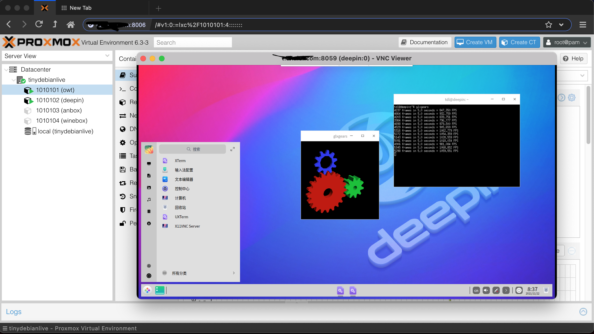
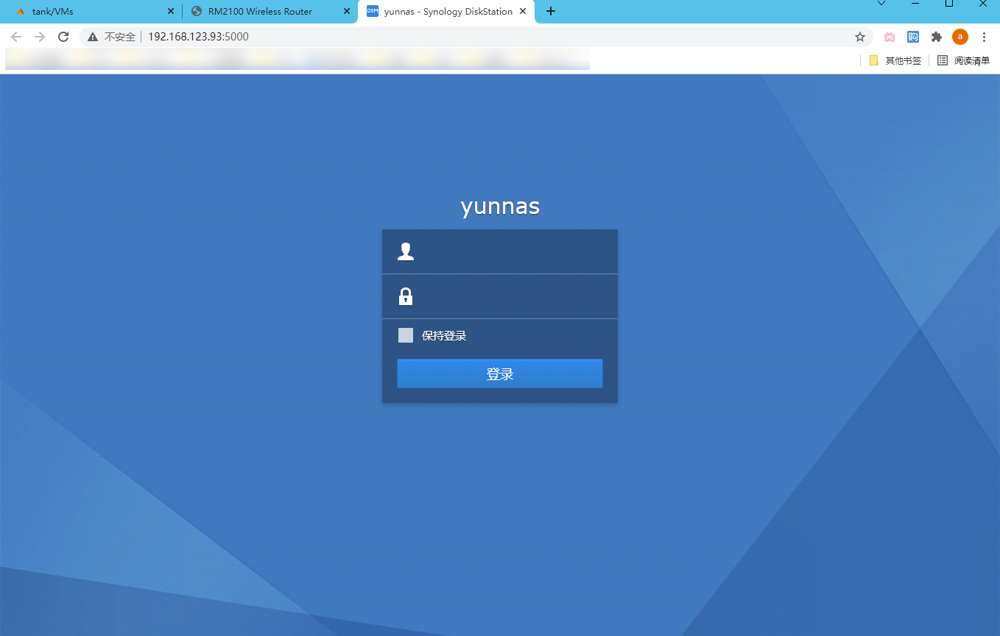

onekeydevdesk : build your own dev hub
=====

onekeydevdesk is a multi-os bundle which implements a live pve in the boot core and an set of sub lxc/qemu containers based around the core，besides，onekeydevdesk is also a "vm-web" centric development stack.

onekeydevdesk consist of two script groups: [inst.sh](p/instintro/) and [ci.sh](p/ciintro/),of which:  
inst.sh is a script which installs onekeydevdesk (and other os) to various targets and help maintain it as onekeydevdesk os's recovery, like web assistant for synology's dsm  
ci.sh is a ci/cd builder script,which can construct up all "your own [ddhub](p/ciusage/)" (including inst.sh),ci.sh is also referred to as onekeydevdesk's codebase,which was made up of ci.sh, and other well-arranged asserts and src, they formed all the onekeydevdesk's codebase  

project repo url: https://gitee.com/minlearn/onekeydevdesk 

demo
-----

inst.sh support dd progress show inside debian installer（ demo video：https://www.bilibili.com/video/BV1ug411N7tn/ ）  

onekeydevdesk can be installed on the cloud hosts and vps,all 3 lxc desktop containers(anbox,winebox,deepin) support hard-accelerated gpu video  

as one of onekeydevdesk's qemu vm,dsm can be installed on vps, with no kvm-nested required upon host  

as one of onekeydevdesk's qemu vm,osx must be installed on a vps with kvm-nested (also,minial 3c3g was required,the pve core need 1c1g),win11 is also supported,cloudosx+cloudwin11=local matedesk  

getting-started
-----

below are tested under vnc of an Debian and Debian flow Linux vps or local host,ubuntu <20.04,centos not recommended

> (download and exectute：)  
> bash <(wget --no-check-certificate -qO- 'https://gitee.com/minlearn/onekeydevdesk/raw/master/inst.sh') -t onekeydevdesk | osx10157  | dsm61715284 | 自定镜像  

> (切换国外镜像：)  
> bash <(wget --no-check-certificate -qO- 'https://github.com/minlearn/onekeydevdesk/raw/master/inst.sh') -t xxx  
> (指定自定义镜像大小以适配进度显示，默认20G：)  
> sudo ./inst.sh -s 30 -t xxx  

上面系统多选1,自定义镜像是你的raw系统硬盘格式经过gzip打包后托管的http/https地址
onekeydevdesk os镜像在gitee或github，qemu版osx和dsm镜像都在OD，仅加了必要驱动和引导制作其它无修改，(onekeydevdesk os镜像,<1G,dsm61715284镜像< 1G,osx10157>8G)，不做说明的情况下，qemu版osx和dsm镜像并不提供开放托管和安装。

安装后，root密码tdl，https://xxx:8006为pve口，pve用户名root密码tdl，vnc客户端连接你机器的ip:8059，密码为tdl，二个lxc box的端口情况在各自的summary页有写，默认密码都是root/tdl，如果是云主机建议开放8000-8100这些端口  

docs
-----

更多请看项目文档库[《更多特点介绍和自助安装使用文档》](p/docs/)部分

donate
-----

btc:  3HFxtzyj36RZ35YvZmb5N4DiHAiCgreezm

usdt: TZ6YPtsojLCJEifNpwm38mmiq7T2gkhGKj

-----

此项目关联 https://gitee.com/minlearn/minlearnprogramming/tree/master/p/onekeydevdeskopen/ ，它是为配合我在《minlearnprogramming》最小编程/统一开发的想法的一个支持项目。  
本项目长期保存,联系作者协助定制onekeydevdesk os包括不限于机型适配，应用集成等。

