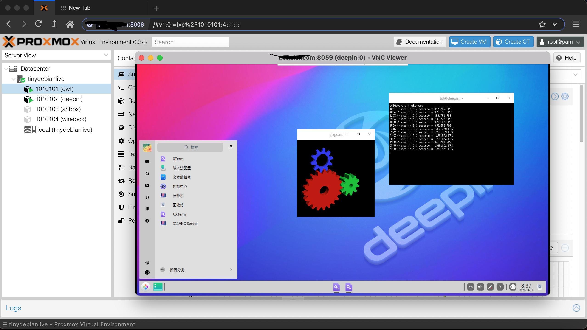
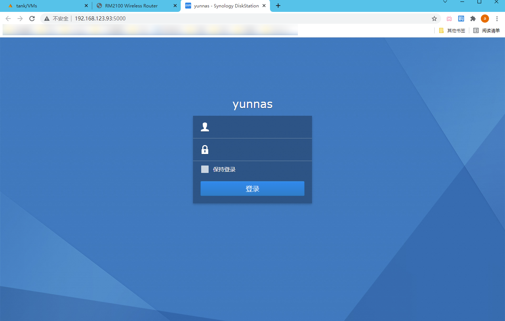

onekeydevdesk : build your own dev hub
=====

onekeydevdesk是一套live pve为boot核心的系统，及一套基于lxc和qemu虚拟的多场景os的打包，同时是云虚拟机系统和web为中心实现的开发栈  
[inst.sh](p/instintro/)是一个和维护安装onekeydevdesk os镜像的脚本，也是onekeydevdesk os的recovery，类似群晖的webassiant   
[ci.sh](p/ciintro/)是onekeydevdesk的构建脚本，与全套的资源文件组成onekeydevdesk的codebase，可用来创建你自己的[ddhub](p/ciusage/)

项目地址：https://gitee.com/minlearn/onekeydevdesk 

演示
-----

inst.sh支持进度显示（ 视频演示：https://www.bilibili.com/video/BV1ug411N7tn/ ）

onekeydevdesk支持安装在云主机上，三lxc系统anbox,winebox,deepin desktop支持显卡加速

dsm支持直接安装在云主机上，无须嵌套虚拟化

osx需要安装在支持嵌套虚拟化的3C3G以上云主机上（pve所在主机留1c1g），加上win11，与本地组matedesk

下载安装及用法
-----

以下尽量在debian系linux云主机vnc界面下或本地虚拟机下完成,ubuntu小于20.04,centos不推荐

> (下载执行：)  
> bash <(wget --no-check-certificate -qO- 'https://gitee.com/minlearn/onekeydevdesk/raw/master/inst.sh') -t onekeydevdesk | osx10157  | dsm61715284 | 自定镜像  

> (切换国外镜像：)  
> bash <(wget --no-check-certificate -qO- 'https://github.com/minlearn/onekeydevdesk/raw/master/inst.sh') -t xxx  
> (指定自定义镜像大小以适配进度显示，默认20G：)  
> sudo ./inst.sh -s 30 -t xxx  

上面系统多选1,自定义镜像是你的raw系统硬盘格式经过gzip打包后托管的http/https地址
onekeydevdesk os镜像在gitee或github，qemu版osx和dsm镜像都在OD，仅加了必要驱动和引导制作其它无修改，(onekeydevdesk os镜像,<1G,dsm61715284镜像< 1G,osx10157>8G)，不做说明的情况下，qemu版osx和dsm镜像并不提供开放托管和安装。

安装后，root密码tdl，https://xxx:8006为pve口，pve用户名root密码tdl，vnc客户端连接你机器的ip:8059，密码为tdl，二个lxc box的端口情况在各自的summary页有写，默认密码都是root/tdl，如果是云主机建议开放8000-8100这些端口  

文档
-----

更多请看项目文档库[《更多特点介绍和自助安装使用文档》](p/docs/)部分

服务
-----

免费
> 只提供inst.sh，可一站式解决你DD中大部分问题，去上面仓库，一键DD即可  
> 仅拥有inst.sh定制能力  

收费1
> 拥有完整源码拥有定制能力。省事一体解决你装机和集成应用的问题。  
> 收费50发源码和资源包onekeydevdesk ci.sh，可加作者个人TG：https://t.me/minlearn_1keydd 获取付款码  
> 个人TG只保持联系不提供无偿技术支持  

收费2
> 拥有完整源码拥有定制能力。省事一体解决你装机和集成应用的问题。  
> 收费100发onekeydevdesk ci.sh源码和资源包，享受源码升级1年，并可加一个永久TG互助组及作者个人TG  
> 可加作者个人TG：https://t.me/minlearn_1keydd 获取付款码加入  
> （加群获社区支持，楼主不定期会在TG互助组里面帮解决问题，个人TG只保持联系不提供无偿技术支持）  

-----

此项目关联 https://gitee.com/minlearn/minlearnprogramming/tree/master/p/onekeydevdeskopen/ ，它是为配合我在《minlearnprogramming》最小编程/统一开发的想法的一个支持项目。  
本项目长期保存,联系作者协助定制onekeydevdesk os包括不限于机型适配，应用集成等。

